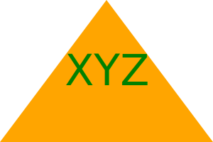

# SVG Logo Maker Project

## Your Task

This is a Node.js command-line application that takes in user input to generate a logo and save it as an .svg file. The application prompts the user to select a color and shape, provide text for the logo, and save the generated SVG to a `.svg` file.


### User Story

```md
AS a freelance web developer
I WANT to generate a simple logo for my projects
SO THAT I don't have to pay a graphic designer
```

## Acceptance Criteria

```md
GIVEN a command-line application that accepts user input
WHEN I am prompted for text
THEN I can enter up to three characters
WHEN I am prompted for the text color
THEN I can enter a color keyword (OR a hexadecimal number)
WHEN I am prompted for a shape
THEN I am presented with a list of shapes to choose from: circle, triangle, and square
WHEN I am prompted for the shape's color
THEN I can enter a color keyword (OR a hexadecimal number)
WHEN I have entered input for all the prompts
THEN an SVG file is created named `logo.svg`
AND the output text "Generated logo.svg" is printed in the command line
WHEN I open the `logo.svg` file in a browser
THEN I am shown a 300x200 pixel image that matches the criteria I entered
```

## Mock-Up

The following image shows a mock-up of the generated SVG given the following input entered by the user: `XYZ` for the text, `green` for the text color, `Triange` from the list of shapes, and `Orange` for the shape color:



## Installation

The shapes.js contributes the following:

-The structure, position, and color of the shapes (circle, square, and triange).

The shapes.test.js contributes the following:

-Successful test results for each of the shapes, when run in the command line.

The index.js contributes the following:

-The specifics for the text element, the question inputs for the command line, the generation and placement of the logo/svg file.

The package.json/package-lock.js contributes the following:

-Details on the dependencies for the project (inquirer, jest).

## Usage

Please click the following link to view a step by step tutorial of the logo generation/command line application.

[Demo](https://drive.google.com/file/d/1l1cECdeZfytoMKftQaVB5JF8-F06A852/view)

## Credits

N/A

## License

MIT License

Copyright (c) 2023 aubreymlj96

Permission is hereby granted, free of charge, to any person obtaining a copy
of this software and associated documentation files (the "Software"), to deal
in the Software without restriction, including without limitation the rights
to use, copy, modify, merge, publish, distribute, sublicense, and/or sell
copies of the Software, and to permit persons to whom the Software is
furnished to do so, subject to the following conditions:

The above copyright notice and this permission notice shall be included in all
copies or substantial portions of the Software.

THE SOFTWARE IS PROVIDED "AS IS", WITHOUT WARRANTY OF ANY KIND, EXPRESS OR
IMPLIED, INCLUDING BUT NOT LIMITED TO THE WARRANTIES OF MERCHANTABILITY,
FITNESS FOR A PARTICULAR PURPOSE AND NONINFRINGEMENT. IN NO EVENT SHALL THE
AUTHORS OR COPYRIGHT HOLDERS BE LIABLE FOR ANY CLAIM, DAMAGES OR OTHER
LIABILITY, WHETHER IN AN ACTION OF CONTRACT, TORT OR OTHERWISE, ARISING FROM,
OUT OF OR IN CONNECTION WITH THE SOFTWARE OR THE USE OR OTHER DEALINGS IN THE
SOFTWARE.